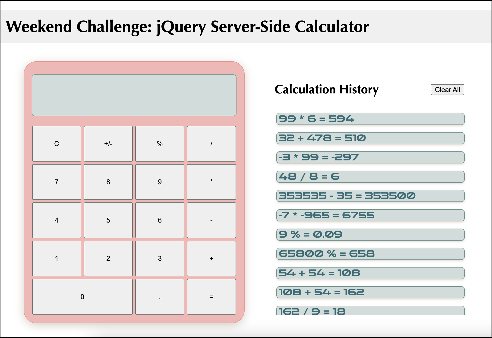

# jQuery Server Calculator

Duration: 2 Day Sprint

Our prompt for this project was to create a calculator that would store both logic and history on a server.  

I began by thinking through only the base goals given and determining what steps I *might* take for each requirement. After weighing the pros and cons of my options, I plotted out a general plan. Once I'd accomplished base mode, I did the same for the stretch goals. 

>**Built with** : Javascript, jQuery, AJAX, HTML & CSS
>
>**Prerequisites** : Node.js : Express : Body Parser
>
>**License** : [Open Font License](https://scripts.sil.org/cms/scripts/page.php?site_id=nrsi&id=OFL) : "Zen Dots" Google Font used for displayed numbers & calculations.

## Screen Shots

**Base Mode ↴**

**Final Product ↴**

## Usage

This is a calculator - hopefully a lot like one you'd use in real life! Press a combination of numbers & operators, and then press the equals sign to calculate the results. 

Beyond basic math...
> The "+/-" button will flip your number from positive/negative
> 
>The "%" button will display the value of the given integers as a percent
>
>For a fun surprise, try typing '01134' and pressing '='

## Notes

I encountered a few different errors while working through each part of my plan, but I was able to solve each without much issue. 

There were a couple of small things I would have liked to complete/fix, but I wound up letting them go. Having the calculator numbers sit in the lower right side of the screen, getting the historic calculations to populate on the screen when clicked... If I'd had another day I would have zhuzhed up the calculation history div a little more, too. 

## Acknowledgement
Thanks to Prime Digital Academy who continue to teach me a staggering amount of info daily!

